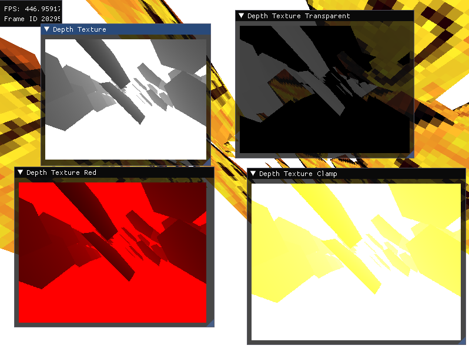

# Details about this fork

It adds support for custom texture readers, now you can sample a in multiple different ways, instead of just reading its data on screen.



Now instead of just inserting the texture, you need to also pass a optional custom texture render pipeline to `renderer.textures`.
The pipeline must be created with `renderer.create_pipeline` with only accepts a fragment shader module, this module will be the texture reader.

```rs
let module = device.create_shader_module(&wgpu::include_spirv!("texture.frag.spv"));

let pipeline = renderer.create_pipeline(
    &device,
    texture_layout,
    module,
    main_render_target_format,
);

let texture_id = renderer.textures.insert((
    depth_texture_bind_group,
    Some(pipeline),
));
```

_Original readme:_

# dear imgui wgpu-rs renderer


[](https://crates.io/crates/imgui-wgpu)
[](https://docs.rs/imgui-wgpu)


Draw dear imgui UIs as a wgpu render pass. Based on [imgui-gfx-renderer](https://github.com/Gekkio/imgui-rs/tree/master/imgui-gfx-renderer) from [imgui-rs](https://github.com/Gekkio/imgui-rs).


# Usage

For usage, please have a look at the [example](examples/hello_world.rs).

# Example

Run the example with
```
cargo run --release --example hello_world
```

# Status

Basic features are useable. Uses `wgpu-0.9` and `imgui-0.7` upstream. `winit-0.24` is used with the examples.

Contributions are very welcome.
